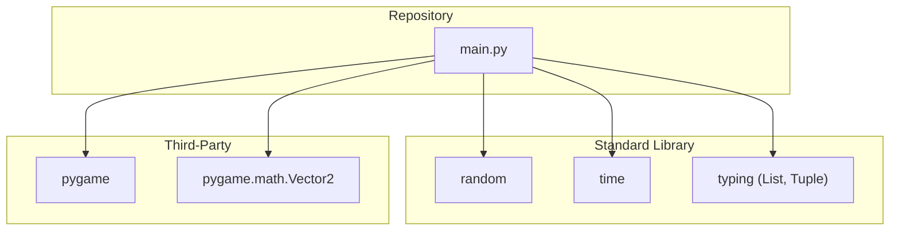
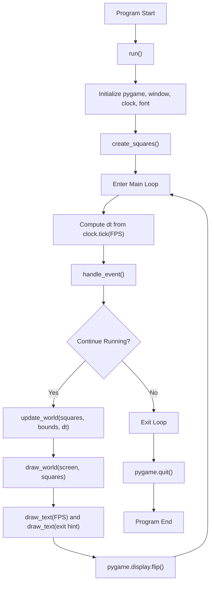
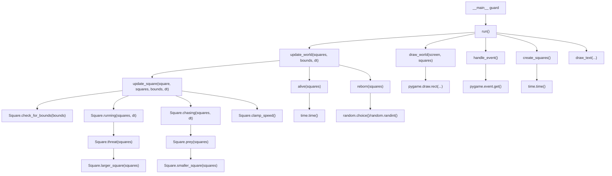
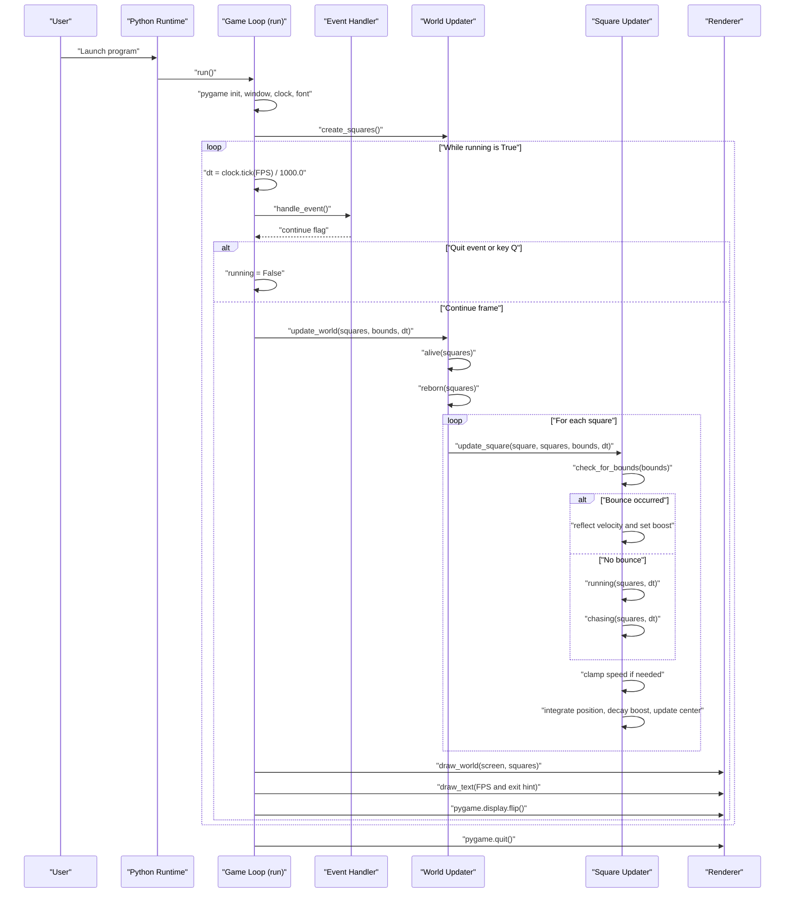

# Architecture Documentation

## Scope
This document describes the architecture implemented in `main.py` for the square simulation.
All relationships below are based on concrete code in the repository.

## 1) Module Dependency Graph

Notes:
- `main.py` is the execution and behavior module.
- No internal package split is present yet; simulation logic is centralized in one file.

## 2) High-Level Runtime Flow

Notes:
- The frame loop is time-step driven (`dt`) and runs until close event or `Q` key.
- Rendering always follows world update in each active frame.

## 3) Function-Level Call Graph

Notes:
- `update_world` is the per-frame orchestration point.
- `update_square` encapsulates movement, steering, bounce, and boost decay.

## 4) Primary Execution Sequence

## Assumptions
- Architecture is documented from `main.py`, which is the active simulation implementation.
- `example.py` appears to be a variant/skeleton and is not the runtime entry path used by default.
